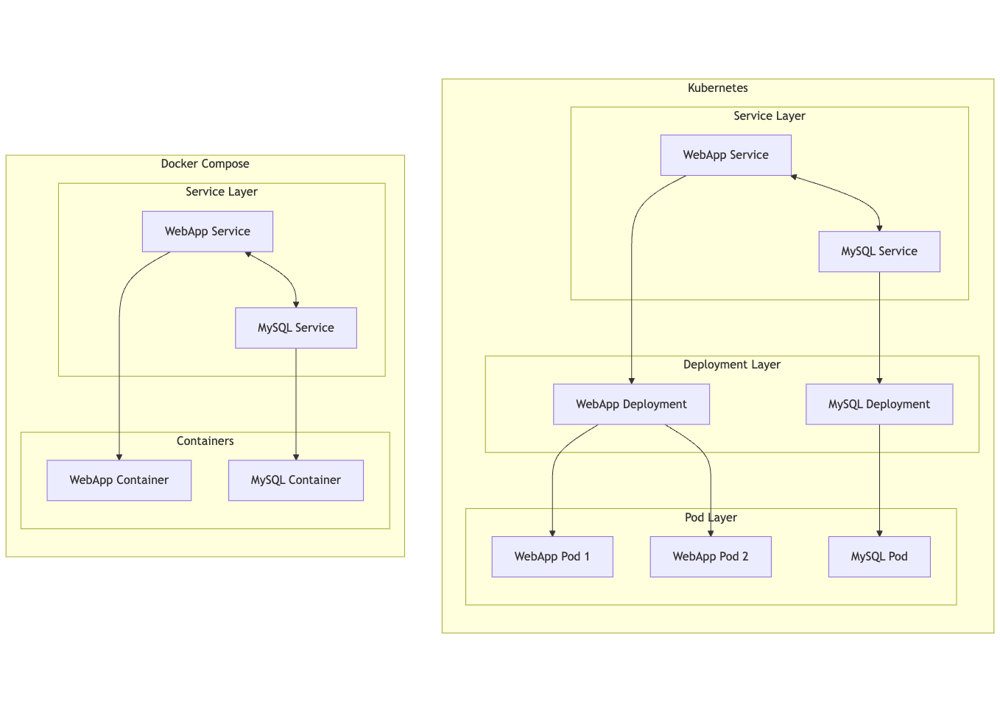

# Sobre mim

- Graduado em Engenharia de Software pela UFG.
- Mais de 13 anos trabalhando com programação, arquitetura e operação.
- Ajudo empresas com práticas DevOps, arquitetura na nuvem e observabilidade.

# Agenda

- Preocupação unânime nas empresas.
- O que é um servidor?
- Dificuldades em administrar servidores físicos.
- Servidores virtuais, famosa VM.
- VMs e seus problemas.
- Containers.
- Containers e seus problemas.
- VMs e containers na prática.
- Orquestração.

# Preocupação unânime nas empresas

1. Reduzir gastos.
2. Aumentar a eficiência.

# O que é um servidor?

Um computador com CPU, memória e disco que fica ligado 24/7 em um ambiente controlado e seguro.

# Dificuldades em administrar servidores físicos

- Alto custo. (TCO)
- Manutenção dificultada porque questões logísticas.
- Ineficiência dos recursos (computadores ociosos)

# Servidores virtuais, a famosa VM

### Através de tecnologias que permitiram virtualização de CPU, memória e disco.

**CPU**: Intel VT-x (2005), AMD-V (2006)

**Memória**: Extended Page Tables (EPT) / Nested Page Tables

**Disco**: I/O MMU (Intel VT-d/AMD-Vi)

### Agora um mesmo computador (Host) pode ser vários computadores virtuais (Guests)

# VMs e seus problemas

- Manter atualizado e configurado.

  - Puppet (2005)
  - Chef (2009)
  - Ansible (2012)

- Pets vs Cattle
- Eficiência vs Isolamento
- Escalonamento vertical
- Ainda muito imperativo (IaC ganhou força de 2010 pra frente)

Obs. Em 2006 a AWS lança seu primeiro produto de infraestrutura: VMs sobe demanda, o Elastic Compute Cloud
(EC2)

# Containers

As tecnologias para rodar containers em ambientes linux já **existiam desde 2007**

- Namespaces (PID, IPC, Network) / Isolamento
- CGroups / Limite de recursos

### Docker nasce e ganha popularidade em 2014.

API que abstraiu a definição de um container (Dockerfile) e facilitou a execução das tecnologias já existentes
(containerd).

- Já nasce declarativo (versionado)
- Modelo compartilhado de recursos (Host-Host)

Obs: No início Docker mantinha a solução proprietária, em 2017 containerd virou open source e foi doado para a
CNCF (Cloud Native Compute Foundation)

# Containers e seus problemas

- Mudança de paradigma (acessar máquina, ver logs, processos)
- Não aplicação do 12Factor (Aplicações nativas para nuvem)
- Containers VM (Gigas de memória e espaço)

# VMs e containers na prática

- Pets vs Cattle
- 12Factor
- Container VM

# Orquestração

- Isolamento **OK**
- Eficiência **OK**

- Comunicação entre os containers
- Escalonamento horizontal

# Docker Compose e Kubernetes

# Orquestração

- Isolamento **OK**
- Eficiência **OK**

- Comunicação entre os containers **OK**
- Escalonamento horizontal **OK**
- Infraestrutura declarativa **OK**

# Obrigado

- @gmtborges (Instagram, Github)
- linkedin.com/in/gmtborges

# Conteúdo

https://github.com/gmtborges/palestra-introducao-containers-orquestracao

{width=640}
